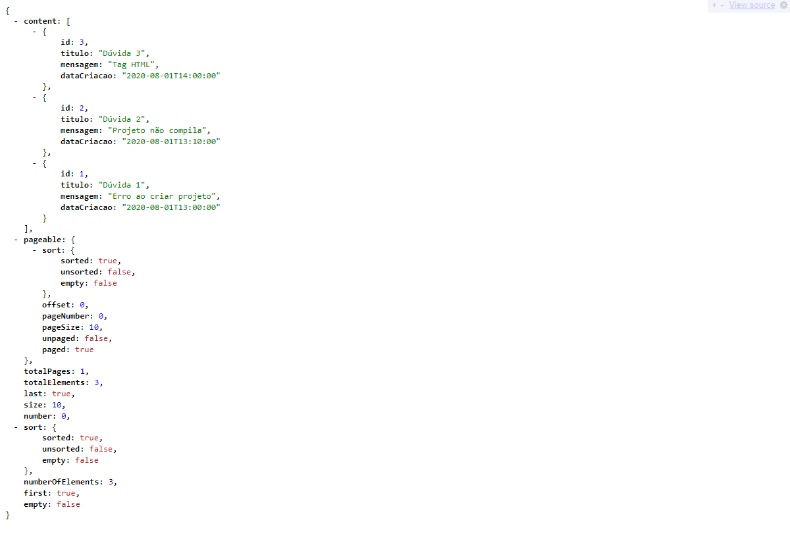
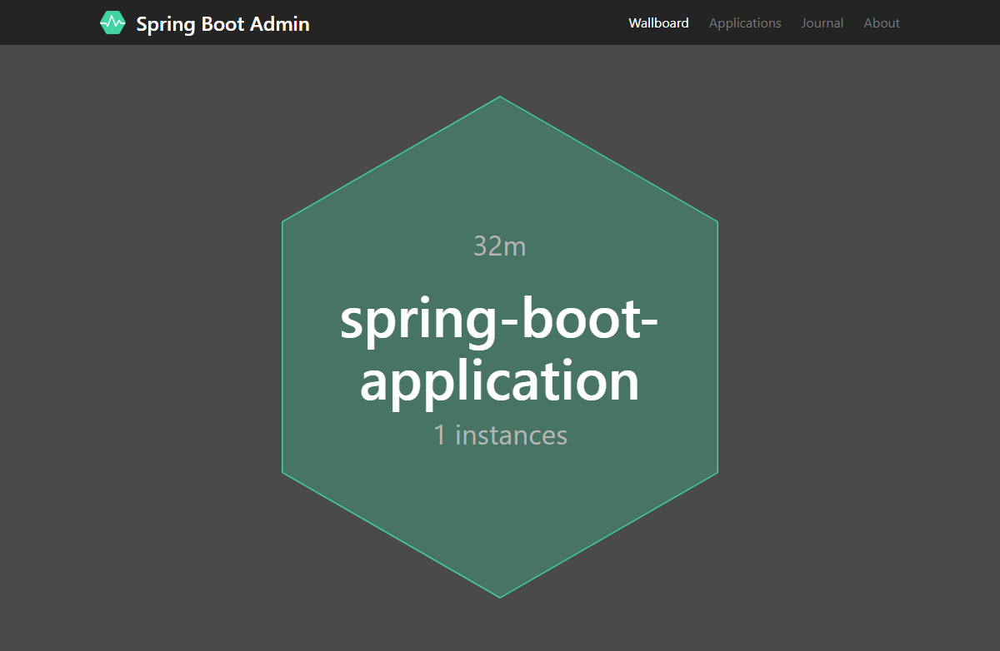

# course-alura-spring-boot (II)

Result of course **[Spring Boot Parte 2: Segurança da API, Cache e Monitoramento](https://cursos.alura.com.br/course/spring-boot-seguranca-cache-monitoramento)** of [Alura](https://alura.com.br).

## What you need

- [JDK 1.8](http://www.oracle.com/technetwork/java/javase/downloads/index.html) or later
- [Maven 3.2+](https://maven.apache.org/download.cgi)

## Usage

- forum-app

    ```bash
    $ cd forum-app
    $ ./mvnw spring-boot:run
    ```

    

- forum-monitor

    ```bash
    $ cd forum-monitor
    $ ./mvnw spring-boot:run
    ```

    
